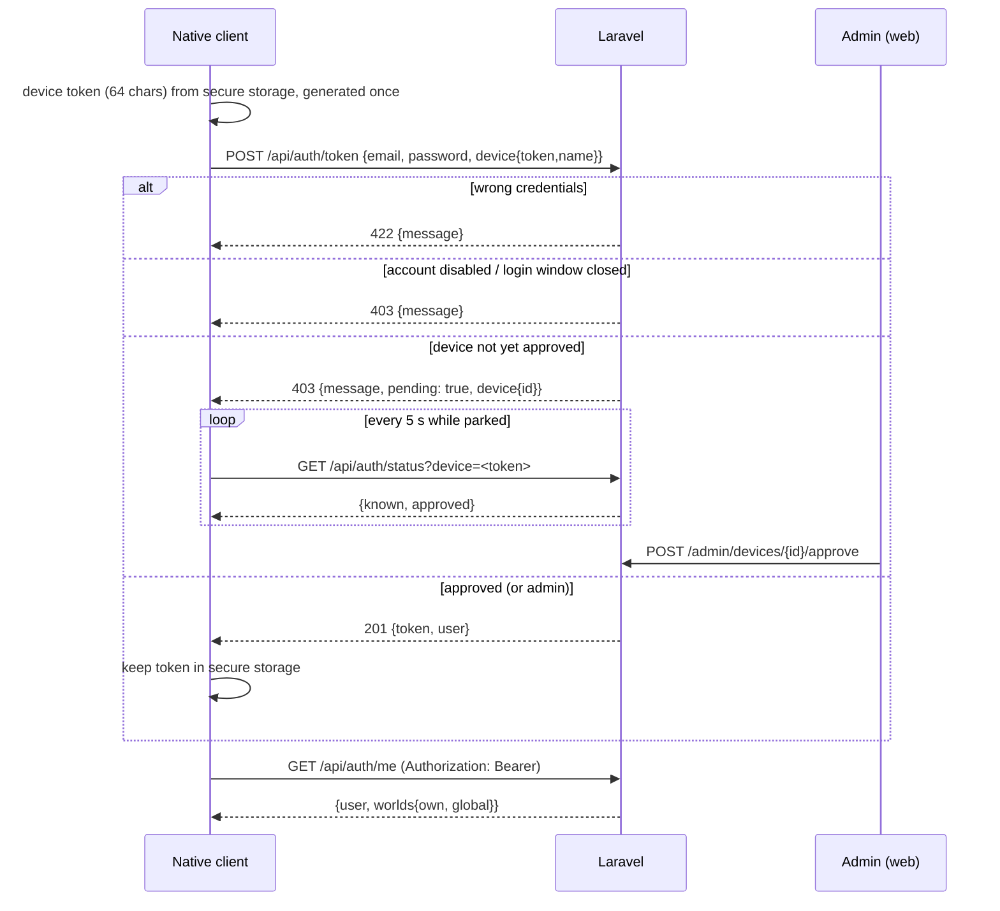
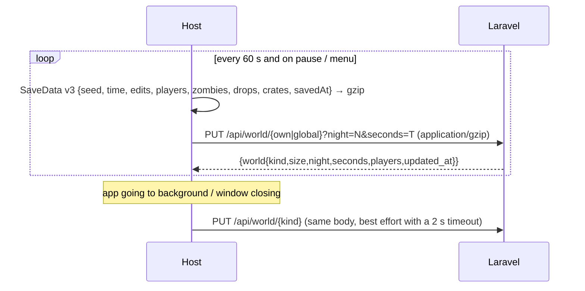
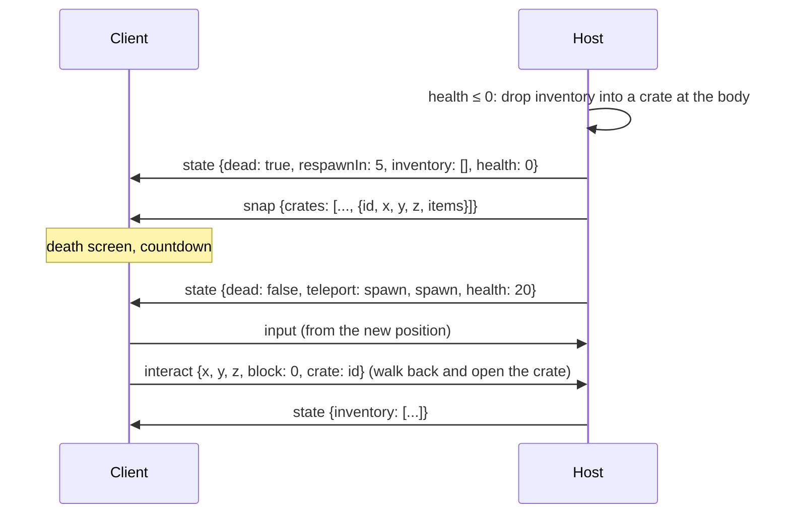

# System design — the flows, with their endpoints and messages

Every sequence names the `/api` endpoint (see `server/routes/web.php`) and the
`protocol.ts` messages it uses. The native client and the browser client take
the same paths; only the first flow differs (token instead of session).

## 1. Sign-in and device approval



Every later `/api` call carries the bearer token. A 401 drops the token
(`AuthApi.me()` returns null → back to the sign-in screen); a 403 from
`EnforceAccessPolicy` (device revoked, account disabled, window closed) also
revokes the token server-side.

## 2. Host a room and invite

```mermaid
sequenceDiagram
  participant H as Host
  participant S as Laravel
  participant P as Invitee
  H->>H: code = makeRoomCode(); id = makePeerId()
  H->>S: POST /api/rooms {code, host_peer_id, host_name, world_kind}
  S-->>H: {room}
  H->>S: GET /api/players
  H->>S: POST /api/rooms/{code}/invites {user_id}
  S-->>H: {invite}
  loop heartbeat every 30 s
    H->>S: PATCH /api/rooms/{code} {host_peer_id, players, user_ids}
  end
  H->>S: GET /api/rooms/{code}/signals?to=<host id>&after=<cursor>  (Signaller, idle 1.5 s / active 0.5 s)
  P->>S: GET /api/invites
  S-->>P: {invites: [{id, code, host_name, players, max_players}]}
```

Leaving: `DELETE /api/rooms/{code} {host_peer_id}` and `bye` to every link.

## 3. Join a room from an invite (or by code)

```mermaid
sequenceDiagram
  participant C as Client
  participant S as Laravel
  participant H as Host
  C->>S: POST /api/invites/{id}/accept   (or nothing, when joining by code)
  S-->>C: {invite, room}
  C->>S: GET /api/rooms/{code}
  S-->>C: {room{host_peer_id}}
  C->>C: RTCPeerConnection + DataChannel "game"
  C->>S: POST /api/rooms/{code}/signal {from, to: host_peer_id, type: offer, data{type,sdp}}
  H->>S: GET .../signals?to=host → offer
  H->>S: POST .../signal {type: answer}
  par ICE
    C->>S: POST .../signal {type: candidate}
    H->>S: POST .../signal {type: candidate}
  end
  C->>S: GET .../signals?to=client (500 ms) → answer, candidates
  Note over C,H: DataChannel open — the client stops polling
  C->>H: hello {v, name, userId}
  alt v mismatch → ignored; room full
    H->>C: full
  else
    H->>C: welcome {v, you, seed, time, edits[], spawn}
    H->>C: state {inventory, health, ...}   (private)
    loop 20 Hz
      H->>C: snap {time, players[], zombies[], drops[], crates[]}
    end
    loop 30 Hz
      C->>H: input {x,y,z,yaw,pitch,anim,slot,aiming}
    end
  end
```

The client regenerates the world from `seed` (bit-exact, see `shared/fixtures/worldgen`)
and applies `edits`; later edits arrive as `blocks {edits[]}`.

## 4. Autosave and the unload beacon



The browser uses `sendBeacon` to `POST /api/world/{kind}/beacon` because it
cannot await on unload; the native client can await a short PUT in
`AppLifecycleListener.onExitRequested` / `didChangeAppLifecycleState(paused)`,
so it uses the normal endpoint.

## 5. Death → crate → respawn



Locally the client renders the crate from the snapshot and the message text
from `state.message`.

## 6. Global world: join, claim, leave

```mermaid
sequenceDiagram
  participant C as Client
  participant S as Laravel
  C->>S: POST /api/global/join
  alt status: host
    S-->>C: {status: host, online}
    C->>C: host a room with world_kind = global; load GET /api/world/global
  else status: client
    S-->>C: {status: client, room, online}
    C->>C: join room (flow 3)
  else status: pending
    S-->>C: {status: pending, host_name, online}
    loop every 3 s
      C->>S: POST /api/global/claim
    end
  end
  C->>S: POST /api/global/leave   (menu / app exit)
```

When the host disappears, clients see the link close, call `claim`, and the
front of the queue becomes the host and uploads the save it last received.
